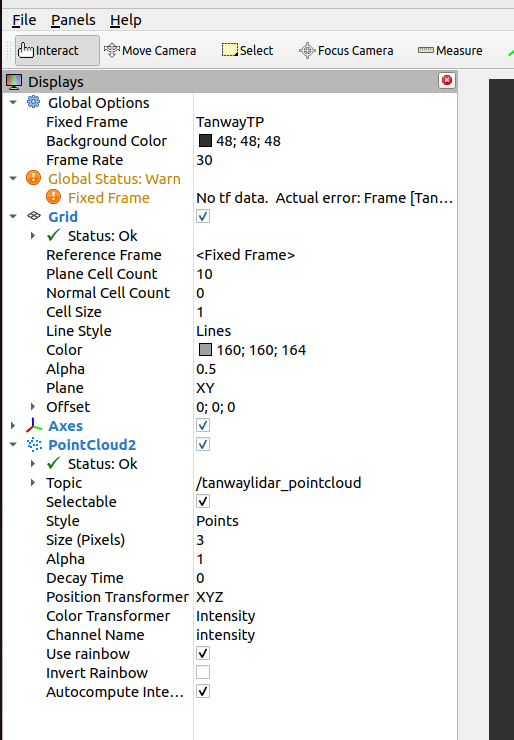

# tanwaylidar_view[v3.0.19]

# 1.1 目录

[TOC]

# 1.2 简介

**tanwaylidar_view** 是探维科技针对所产雷达系列产品的上位机软件，其中包含：

1. 雷达软件开发工具包SDK；
2. ROS拓展功能；
3. ROS2拓展功能。

软件在Ubuntu18.04（ROS）、22.04（ROS2）环境下开发测试通过，可在ROS（Ubuntu18.04、20.04）和ROS2（Ubuntu20.04、22.04）环境下使用，ROS安装参见[安装教程](http://wiki.ros.org/ROS/Installation "")，ROS2安装参见[安装教程](https://docs.ros.org/en/humble/Installation.html "")。


# 1.3 软件安装与参数介绍

## 1.3.1 软件下载与编译

### a. ROS环境

1. 打开终端（快捷键：ctrl+alt+T）

2. 创建ROS工作空间

```bash
mkdir -p ~/tanwaylidar_driver/src
cd ~/tanwaylidar_driver/src
```

3. 下载代码

注意: 如需获取特定版本，请联系探维公司技术支持。

```bash
git clone https://github.com/TanwayLab/tanwaylidar_view.git
cd tanwaylidar_view/sdk
git submodule init
git submodule update
```

输入用户名密码，下载成功后，\~/tanwaylidar_driver/src文件夹下就会出现程序包。此步骤也可直接在github的项目下直接下载程序的zip压缩包，然后解压到\~/tanwaylidar_driver/src文件夹下。

4. 编译程序
如果不想使用pcl依赖，找到option(DISABLE_PCL_ROS "Disable PCL ROS integration" OFF)，将开关置为ON。如果已经使用OFF编译过，需要rm -rf build/ devel/ 后，再重新编译。
```bash
cd ~/tanwaylidar_driver && catkin_make
```

5. 配置.launch文件（雷达连接参数）

   在路径~/tanwaylidar_driver/src/tanwaylidar_view/launch/下找到对应设备型号的.launch文件进行如下修改：

   - 实时连接参数配置示例（即直接连接雷达使用，以Duetto设备型号为例）

     ```xml
     	<!--连接模式:仅支持"on-line"、"off-line"两种模式配置-->
     	<param name="ConnectType" type="string" value="on-line" />
     
     	<!--实时模式下配置-->
     	<!--本机IP地址-->
     	<param name="LocalHost" type="string" value="192.168.111.204" />
     
     	<!--雷达设备的IP地址-->
     	<param name="LidarHost" type="string" value="192.168.111.51" />
     	<!--雷达发送点云数据的目的端口（即设备接收点云数据的端口）-->
     	<param name="LocalPointloudPort" type="int" value="5600" />
     	<!--雷达发送DIF数据的目的端口（即设备接收DIF数据的端口）-->
     	<param name="LocalDIFPort" type="int" value="5700" />
     ```

   - 回放雷达数据参数配置示例（仅支持读取pcap文件，以Duetto设备型号为例）

     ```xml
     	<!--连接模式:仅支持"on-line"、"off-line"两种模式配置-->
     	<param name="ConnectType" type="string" value="off-line" />
     
     	<!--回放模式下配置-->
     	<!--PCAP文件绝对路径-->
     	<param name="PcapFilePath" type="string" value="/home/tanway/lidar_data/duetto.pcap" />
     
     	<!--雷达设备的IP地址-->
     	<param name="LidarHost" type="string" value="192.168.111.51" />
     	<!--雷达发送点云数据的目的端口（即设备接收点云数据的端口）-->
     	<param name="LocalPointloudPort" type="int" value="5600" />
     	<!--雷达发送DIF数据的目的端口（即设备接收DIF数据的端口）-->
     	<param name="LocalDIFPort" type="int" value="5700" />
     ```

6. 设置环境变量

   - 当前用户长期生效方式，如下:

   ```bash
      echo "source ~/tanwaylidar_driver/devel/setup.bash" >> ~/.bashrc
      source ~/.bashrc
   ```

   - 当前终端中临时生效方式，如下:

   ```bash
      cd ~/tanwaylidar_driver
      source devel/setup.bash
   ```

### b. ROS2环境

1. 下载代码

注意: 如需获取特定版本，请联系探维公司技术支持。

```bash
#解压软件包
cd ~
tar xzvf tanwaylidar_view-*.tar.gz
```

2.  编译程序

(1) 修改文件CmakeLists.txt宏COMPILE_METHOD为COLCON

```bash
set(COMPILE_METHOD COLCON)
```

(2) 如果当前ROS2使用的pcl版本依赖STL的智能指针(即Ubuntu22.04)，需在CmakeLists.txt文件中找到rclcpp_FOUND并注释掉add_definitions(-DPCL_USE_BOOST)

```bash
#add_definitions(-DPCL_USE_BOOST)
```

(3) 编译

```bash
source /opt/ros/<distro>/setup.bash   #<distro>替换为ROS2版本，如galactic或humble
cd ~/tanwaylidar_view
colcon build
```

3. 配置.launch文件（雷达连接参数）

在路径 launch/下找到tanwaylidar.py文件进行如下修改：

   - 实时连接参数配置示例（即直接连接雷达使用，以Tempo-A2设备型号为例）

     (1) 修改电脑IP为与雷达通信的IP，默认为"192.168.111.204"，同时修改网关为“192.168.111.1”；

     (2) 修改launch内启动模式为on-line、修改雷达型号等参数：

     ```python
        Node(
            package='tanwaylidar_view',
            namespace='tanwaylidar_view',
            executable='TanwayLidar_MainNode',
            name='TanwayLidar_MainNode',
     
            parameters=[{
                'LidarType': 5,
                'ConnectType': 'on-line', 
                'topic': "/tanwaylidar_pointcloud",
                'LocalHost': "192.168.111.204",
                'LocalPointloudPort': 5600,
                'LocalDIFPort': 5700,
                'LidarHost': "192.168.111.51",
                # other parameters...
                }],
            output='screen'
        ),
     ```

     (3) 打开一个新的终端，执行如下指令：

     ```bash
     cd ~/tanwaylidar_view
     source install/setup.bash
     ros2 launch launch/tanwaylidar.py
     ```

   - 回放雷达数据参数配置示例（仅支持读取pcap文件，以Tempo-A2设备型号为例）

     (1) 按照前述说明，修改launch内启动模式、pcap文件绝对路径、雷达型号、网络配置等参数：

     ```python
        Node(
            package='tanwaylidar_view',
            namespace='tanwaylidar_view',
            executable='TanwayLidar_MainNode',
            name='TanwayLidar_MainNode',
     
            parameters=[{
                'LidarType': 5,
                'ConnectType': 'off-line', 
                'PcapFilePath': '/home/tanway/lidar_data/tempo.pcap', # your pcap file path
                'topic': "/tanwaylidar_pointcloud",
                'LocalHost': "192.168.111.204",
                'LocalPointloudPort': 5600,
                'LocalDIFPort': 5700,
                'LidarHost': "192.168.111.51",
                # other parameters...
                }],
            output='screen'
        ),
     ```

        - 雷达型号配置说明

          parameter中 LidarType参数对应着雷达型号，可参考下表进行雷达型号设置，该参数可以在common.h文件中查看：

     ```xml
     LT_Tensor16            :0
     LT_Tensor32            :1
     LT_Scope192            :2
     LT_Duetto              :3
     LT_TempoA1             :4
     LT_TempoA2             :5
     LT_ScopeMini           :6
     LT_TempoA3             :7
     LT_TempoA4             :8
     LT_Tensor48            :9
     LT_Tensor48_Depth      :10
     LT_Scope256            :11
     LT_Scope256_Depth      :12
     LT_FocusB1             :13
     LT_Scope256_SmallBlind :14
     LT_FocusB2_B3_MP,      :15
     LT_Scope128H,          :16
     LT_Scope128,           :17
     LT_Scope128F,          :18
     LT_FocusB2_64,         :19 
     LT_FocusT,             :20
     LT_TW360,              :21
     ```

     (2) 打开一个新的终端，执行如下指令：

     ```bash
     cd ~/tanwaylidar_view
     source install/setup.bash
     ros2 launch launch/tanwaylidar.py
     ```

4. Rviz2参数配置说明

运行launch/tanwaylidar.py时，会自动运行rviz2节点并导入config/show.rviz配置。
若用户自行打开rviz，需要注意修改如下配置，如下图所示，

 - Fixed Frame 修改为 “TanwayTP”
 - 增加PointCloud2类型数据，其中Topic为“/tanwaylidar_pointcloud”




## 1.3.2 launch参数介绍

1.点云时间戳参数

- 通过配置launch文件中的UseLidarClock开关定义点时间戳，默认值为true。true为雷达时间，即每个点的点时间戳为激光雷达里每个点扫描时刻赋值的时间，通过UDP上传并参考网络协议进行解析；false为每个点所在UDP包被上位机接收时刻的上位机系统时间，即一个UDP包内的所有点共用一个时间。**注：当为离线模式时，点时间戳的系统时间为此时收到该UDP包的时间，并非PCF帧头的时间。**
- 通过配置launch文件中的FrameTimeStampType开关定义帧时间戳，默认值为last_point。first_point为当前帧FOV内第一个点的时间戳，last_point为当前帧FOV内最后一个点的时间戳。**注：Fov内的第一/最后一个点，不限定为有效点。**

2.分帧模式参数

- 通过配置launch文件中的CycleCountFrameSplit开关控制所使用的分帧模式，默认值为false。**该参数目前仅支持Scope256与Scope128H型号。**

  - true为仅采用周期计数和帧计数的分帧模式。周期计数为每百毫秒周期递增，帧计数为每百毫秒周期内每个UDP包递增，本分帧模式通过对比每个UDP包的周期计数是否有变化，且当前包的帧计数小于上一包的帧计数来判断是否分帧。说明：周期计数分帧模式相比采用默认分帧模式分帧会有一定的数据发布延时，因为只有收到下一帧的数据时才判断上一帧结束，进行回调。
  - false为默认分帧模式，由当前帧末尾扫描点与周期计数两个条件共同决定是否分帧。其中，当前帧末尾扫描点为优先触发逻辑，基于点的水平角度、镜面号、机芯号特性判断是否为当前帧的末尾扫描点，若找到当前帧的末尾扫描点，则触发进行回调。周期计数条件为第二判断逻辑，目的为防止UDP丢包时分帧失败的情况，判断条件为对比每个UDP包的周期计数是否有变化，增强了丢包容错性。
  
  

# 1.4 点云显示软件使用(ROS为例)

1. 修改电脑IP为与雷达通信的IP，默认为"192.168.111.204"

2. 运行程序，正常查看点云 

```bash
【以Tensor32设备为例】roslaunch tanwaylidar_view Tensor32.launch
【以Tensor48设备为例】roslaunch tanwaylidar_view Tensor48.launch
【以Scope256设备为例】roslaunch tanwaylidar_view Scope256.launch
【以Duetto设备为例】roslaunch tanwaylidar_view Duetto.launch
【以Tempo设备为例】roslaunch tanwaylidar_view TempoA4.launch
【以FocusB1设备为例】roslaunch tanwaylidar_view FocusB1.launch
【以FocusB2设备为例】roslaunch tanwaylidar_view FocusB2.launch
```


# 1.5 IP修改工具使用(仅支持TensorPro)

## 1.5.1 操作

使用命令：

```bash
rosrun tanwaylidar_view tensorpro_interfaces
```

弹出用户交互界面如下：


## 1.5.2 参数说明

输入Mac地址、IP地址和端口信息应符合以下规则，否则将会出错。

- IP地址范围为0.0.0.0至255.255.255.255

- 端口的范围为0至65535,建议端口号设置为大于1024的值

- Mac地址范围为00-00-00-00-00-00至FF-FF-FF-FF-FF-FF

- 上位机与激光雷达IP地址应处于同一网段内

- 激光雷达设备出厂时，默认IP和端口号设计如下：

  激光雷达IP：192.168.111.51，激光雷达端口号：5050

  上位机IP：192.168.111.204，上位机端口号：5600


## 1.5.3 验证连接

- 激光雷达供电工作，利用网线将上位机与激光雷达连接，并将上位机IP地址设置为激光雷达数据发送的目的地址。

- 在“验证与雷达的通信”区域输入IP和端口信息（默认值为雷达出厂网络参数），点击“测试雷达连接”。当连接正常且信息输入正确时，会出现如下图所示的状态栏显示，提示源数据来源和数据长度。


## 1.5.4 修改网络参数

- 激光雷达供电工作，利用网线将上位机与激光雷达连接，并将上位机IP地址设置为激光雷达数据发送的原目的地址。

- 在“验证与雷达的通信”区域输入上位机IP和端口信息，此IP需与上位机IP一致，否则无法发送修改指令。

- 在“修改雷达和接受端信息”区域填写激光雷达的设备Mac信息（一般可从雷达机身的铭牌信息后获得或使用Wireshark抓包工具获取）、新设IP地址和端口信息，点击“确认修改”（因不同操作系统存在权限差异，可能会自动弹出终端要求用户输入密码获取权限，请及时输入用户密码以确保操作成功进行）。

- 当连接正常且信息输入正确时，会出现如下图所示的状态栏显示，提示"【成功】雷达修改操作成功，请重新启动雷达以应用最新配置！"。

- 断开激光雷达电源，重新供电后新配置生效。

- 使用本软件的验证功能或Wireshark等网络调试助手，确认激光雷达IP信息修改生效。

