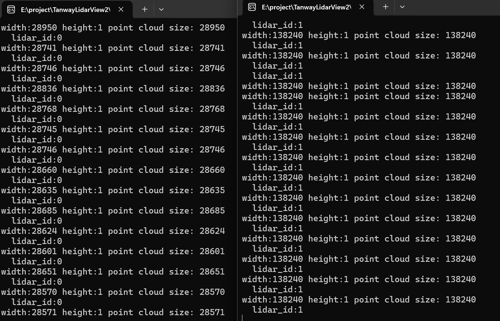

# TanwayLidarSDK2[v2.0.6]

## 1 介绍

TanwayLidarSDK2是探维科技针对所售雷达产品开发的SDK开发包，主要实现激光雷达原始UDP数据的解析和计算，以获取三维点云坐标信息、强度信息等属性的功能，支持客户进行定制化的功能开发和集成，帮助用户在多种操作系统中快速构建基于激光雷达点云的应用程序。

## 2 SDK的下载

git下载链接如下：

```bash
git clone https://github.com/TanwayLab/TanwayLidarSDK.git
```

说明，TanwayLab/TanwayLidarSDK仓库更新频率相对较低，可通过技术支持人员获取下载最新版本，下载压缩包再解压到指定目录。

## 3 编译支持

- ##### Windows平台

  MSVC（VS2019已测试），将开发包的SDK文件夹直接拷贝至工程中，如果仅使用本SDK进行测试，可以直接将demo文件夹下的Demo_UseSDK.cpp文件导入到工程中，并作为程序入口（demo文件中含有main()入口），进行编译即可；集成到具体项目中使用可直接将文件夹TanwayLidarSDK下除demo文件夹外的源码拷贝至开发项目中，并添加所有.h文件即可使用。

  如果仅使用本SDK进行测试，可切换到demo所在文件夹执行命令 `cmake .. -G "Visual Studio 16 2019"`，通过VS2019打开生成的run_demo.sln工程，设置release  ×64模式，在项目run_demo上右键，“设为启动项目”后，即可编译运行。
- ##### Ubuntu平台

  g++ (ubuntu18.04,ubuntu20.04已测试) ，如果仅使用本SDK进行测试，可进入到下载完成后的TanwayLidarSDK目录下，在demo文件夹下执行cmake . . && make命令，编译成功后执行./run_demo命令，即可运行示例程序；集成到具体项目中可直接使用除demo文件夹外的源码进行开发。

## 4 文件结构


SDK中包含以下文件：

1. about：定义了常量字符串以表示不同雷达型号；定义是否采用调试模式、版本号；提供辅助函数用于将整型的雷达型号转换为对应字符串表示；
2. config：algo_table.json文件用于配置点云处理算法，如需更改算法参数请联系技术支持；lidar_config.json文件用于配置雷达参数；
3. demo：示例代码，支持在线和回放模式；
4. doc：包含一系列说明文档：

   [参数详解](doc/参数详解.md)：详细介绍了include文件夹下 `common.h`和 `user_define.h`中定义的各参数含义；

   [接口说明](doc/接口说明.md) ：介绍了 `ILidarDevice.h` 中定义的纯虚函数接口类，解释接口的功能和用途；

   [状态码详解](doc/状态码详解.md)：提供了一系列表示错误码和提示代码的列表；

   [点云解算流程介绍](doc/点云解算流程介绍.md)：以 Tensor48 型号雷达为例，详细介绍 SDK 如何解析和发布雷达扫描数据。
5. include：定义点云类型结构、错误码信息等；
6. lib：算法链接库；
7. lidar：`LidarDevice`类继承于 `ILidarDevice`接口类，并实现了该接口所要求的方法。`LidarDevice`类主要用于管理激光雷达设备的操作，如启动、停止、设置参数、解析点云数据等；
8. pics：保存README中图片；
9. utils：工具函数，如提供数据缓存、获取系统时间、进制转换等函数。

**如需详细参数介绍等，可参考doc文件下的说明文档。**

## 5 使用示例

### 5.1 lidar_config.json文件介绍

Tanway雷达SDK支持通过JSON配置文件灵活设置雷达工作模式、网络参数、离线数据处理以及算法功能。JSON配置文件位于SDK/config文件夹下，命名为lidar_config.json。

配置文件主要包含以下几个部分：

* 雷达工作模式
* 雷达类型
* 在线模式配置
* 离线模式配置
* 算法功能配置

#### 5.1.1 基础配置

```json
// 雷达工作模式
"lidar_mode": "on-line"  // 可选值: "on-line" 或 "off-line"

// 雷达类型
"lidar_type": "LT_Duetto"  // 可选值: "LT_Scope128", "LT_FocusB2", "LT_FocusT"等,具体参考common.h中定义
```

#### 5.1.2 在线模式配置

```json
// 当lidar_mode设置为"on-line"时，SDK将使用以下参数直接连接雷达设备：
"on-line_config": {
    "lidar_ip": "192.168.111.51",    // 雷达设备IP地址
    "host_ip": "192.168.111.204",    // 主机(接收端)IP地址
    "data_port": 5600,               // 点云数据接收端口
    "dif_port": 5700,                // 设备信息接收端口
    "imu_port": 5700,                // IMU数据接收端口
    "lidar_id": 0                    // 雷达ID，用于区分多台雷达
}
```

#### 5.1.3 离线模式配置

```json
// 当lidar_mode设置为"off-line"时，SDK将从PCAP文件读取数据：
"off-line_config": {
    "pcap_file_path": "test.pcap",   // PCAP文件路径，支持相对路径（相对于可执行文件的目录）或绝对路径
    "lidar_ip": "192.168.111.51",    // 雷达IP地址
    "data_port": 5600,               // 点云数据接收端口
    "dif_port": 5700,                // 设备信息接收端口
    "imu_port": 5700,                // IMU数据接收端口
    "lidar_id": 0,                   // 雷达ID，用于区分多台雷达
    "need_replay": true              // 是否循环播放，true为播放完毕后循环播放
}
```

#### 5.1.4 算法配置

```json
// SDK支持点云数据处理算法，可以通过以下设置控制：
"algo_config": {
    "enabled": true,                        // 是否启用算法功能
    "algo_table_path": "../config/algo_table.json"  // 算法配置表路径，支持相对路径或绝对路径
}
```

#### 5.1.5 配置文件使用方法

Demo_UseSDK.cpp通过以下方式加载配置文件：

* 指定路径：

  linux下，在demo文件夹下编译通过后，使用下面命令从指定路径加载lidar_config.json文件运行

```bah
./run_demo path/to/lidar_config.json
```

​		win下，在MSVC编译器中，run_demo项目上右键-->属性-->调试-->命令参数一栏中输入lidar_config.json的路径，如`../config/lidar_config.json`，点击应用即可从指定路径加载配置文件编译运行。

* 默认路径：如果未指定配置文件路径，SDK 将尝试从默认位置 `../config/lidar_config.json`加载。

### 5.2 连接实时的雷达设备

将 `"lidar_mode"`置为"on-line"，只需配置"on-line_config"模块下的参数即可，具体配置方式参考[5.1.2](#5.1.2 在线模式配置)：

```json
{
    "lidar_mode": "on-line",
    "lidar_type": "LT_Duetto",
    "on-line_config": {
        "lidar_ip": "192.168.111.51",
        "host_ip": "192.168.111.204",
        "data_port": 5600,
        "dif_port": 5700,
        "imu_port": 5700,
        "lidar_id": 0
    },
    "algo_config": {
        "enabled": true,
        "algo_table_path": "../config/algo_table.json"
    }
}

```

输出结果参考 [5.5节](#5.5 **回调函数输出打印信息**)

### 5.3 回放.pcap文件

将 `"lidar_mode"`置为"off-line"，只需配置"off-line_config"模块下的参数即可，具体配置方式参考[5.1.3](#5.1.3 离线模式配置)：

```
{
    "lidar_mode": "off-line",
    "lidar_type": "LT_FocusT",
    "off-line_config": {
        "pcap_file_path": "C:/data/capture.pcap",
        "lidar_ip": "192.168.111.51",
        "data_port": 5600,
        "dif_port": 5700,
        "imu_port": 5700,
        "lidar_id": 0,
        "need_replay": true
    },
    "algo_config": {
        "enabled": true,
        "algo_table_path": "E:\\TanwaySDK\\config\\algo_table.json"
    }
}
```

注意：在Win环境下使用绝对路径要使用双反斜杠，即 `C:\Users\Downloads`应写为 `C:\\Users\\Downloads`或者使用斜杠 `C:/Users/Downloads`

输出结果参考 [5.5节](#5.5 **回调函数输出打印信息**)

### 5.4 **算法的使用**

参考[5.1.4](#5.1.4 算法配置)进行配置。

如果不需要使用算法，仅使用SDK进行解析点云数据，则将 `"enabled"`置为false，并在CmakeList中根据系统和平台，取消对算法库的依赖：


### 5.5 **回调函数输出打印信息**

当点云数据触发回调时，会打印当前帧的点云信息，其中width对应点云数量，height在回调函数中设置固定为1，注意：第一帧数据会较少，因为雷达启动时不能保证从镜面0°开始扫描，所以第一帧数据会不完整

```cpp
virtual void OnPointCloud(const LidarInfo &lidarInfo, const UserPointCloud &pointCloud){
	/*
	*The point cloud struct uses a const reference. 
	*Please copy the point cloud data to another thread for use.
	*Avoid directly operating the UI in the callback function.
	*/
	std::cout << "width:" << pointCloud.width 
			  << " height:" << pointCloud.height 
			  << " point cloud size: " << pointCloud.points.size() << std::endl;
  }
```

**正常运行后输出的信息**


其中【algo】打印信息代表现在生效的算法，与雷达型号和algo_table.json文件中算法开关的配置有关，如果使用的雷达型号在json文件中没有开启任何算法，或者没有创建算法实例，则不会打印出【algo】的信息

### 5.6 **连接多台雷达**

1. 在sdk/config文件夹下复制一份lidar_config.json文件，重命名为lidar_config_copy.json，并更改其中的 `lidar_id`为1，用于区分不同雷达实例。注意，在线模式下多台雷达的绑定端口号不能一致。

```
// lidar_config.json
{
    "lidar_mode": "on-line",
    "lidar_type": "LT_Duetto",
    "on-line_config": {
        "lidar_ip": "192.168.111.51",
        "host_ip": "192.168.111.204",
        "data_port": 5600,
        "dif_port": 5700,
        "imu_port": 5700,
        "lidar_id": 0
    },
    "off-line_config": {
        "pcap_file_path": "test.pcap",
        "lidar_ip": "192.168.111.51",
        "data_port": 5600,
        "dif_port": 5700,
        "imu_port": 5700,
        "lidar_id": 0,
        "need_replay": true
    },
    "algo_config": {
        "enabled": true,
        "algo_table_path": "../config/algo_table.json"
    }
}

// lidar_config_copy.json
{
    "lidar_mode": "off-line",
    "lidar_type": "LT_FocusB1",
    "on-line_config": {
        "lidar_ip": "192.168.111.51",
        "host_ip": "192.168.111.204",
        "data_port": 5601,
        "dif_port": 5701,
        "imu_port": 5701,
        "lidar_id": 1
    },
    "off-line_config": {
        "pcap_file_path": "test_B1.pcap",
        "lidar_ip": "192.168.111.51",
        "data_port": 5600,
        "dif_port": 5700,
        "imu_port": 5700,
        "lidar_id": 1,
        "need_replay": true
    },
    "algo_config": {
        "enabled": true,
        "algo_table_path": "../config/algo_table.json"
    }
}
```

2. 如果需要区分每个点所属雷达，需要在user_define.h中增加字段，根据自己的环境在相应的 `UserPoint`下增加 `int lidar_id=-1`，并在common.h中增加语句，用于将雷达id在回调时赋值给每个点

```cpp
MemberCheck(lidar_id);

template <typename PointT>
inline typename std::enable_if<!PointT_HasMember(PointT, lidar_id)>::type
setLidar_id(PointT &point, const unsigned int &value) {}

template <typename PointT>
inline typename std::enable_if<PointT_HasMember(PointT, lidar_id)>::type
setLidar_id(PointT &point, const unsigned int &value) {
  point.lidar_id = value;
}
```

3. 在lidar/LidarDevice.cpp文件中的回调函数内增加： `setLidar_id(basic_point, _lidarInfo.lidarID)`见下面第15行

```cpp
void LidarDevice::PointCloudCallback(TWPointCloud::Points &points,
                                     bool callback, uint64_t frameIndex) {
  if (_isLidarReady) {
    if (_lidarAlgo)
      _lidarAlgo->Process(points);

    int pointSize = points.size();

    for (int i = 0; i < pointSize; i++) {
      `````````````//省略此处代码
      setT_usec(basic_point, point.t_usec);
      setAPDTemp(basic_point, point.apd_temp);
      setPulseCodeInterval(basic_point, point.pulseCodeInterval);

      setLidar_id(basic_point, _lidarInfo.lidarID);
  
      _pointCloudPtr->push_back(std::move(basic_point));
    }

    if (callback) {
      ``````````````````````//省略此处代码
    }
  }
}
```

4. 即可通过访问 `point.lidar_id`来判断每一个点所属雷达。在 `OnPointCloud`中添加语句以访问每个点的 `lidar_id`。
5. 如果只需要获取整帧点云的所属雷达ID，可在 `OnDeviceInfoFrame`函数中打印查看。
6. 多进程启动多台雷达：
   * linux下，在demo文件夹下新建两个终端，输入不同的json文件地址以启动两个雷达实例，参考[5.1.5](#5.1.5 配置文件使用方法)；
   * win下，复制demo文件夹下编译出的run_demo.vcxproj，重命名为run_demo2.vcxproj。在编译器中，将现有的run_demo项目重命名为run_demo1，然后在解决方案上右键-->添加-->现有项目，选择run_demo2.vcxproj后，将新加载的run_demo项目重命名为run_demo2，然后分别在两个项目上右键-->属性-->常规-->中间目录重命名为 `run_demo1.dir\Release\`和 `run_demo2.dir\Release\`，下方的目标文件名重命名为 `run_demo1`和 `run_demo2`，分别在两个项目上右键-->属性-->调试-->命令参数，输入 `lidar_config.json`和 `lidar_config_copy.json`文件的路径。解决方案上右键-->属性-->启动项目-->选择“多个启动项目”，将 `run_demo1`和 `run_demo2`均选为“启动”，然后编译运行即可启动两个进程。
7. 同时回放两个pcap包的运行结果：

